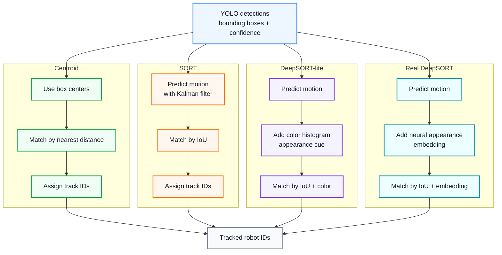

# Tracking Algorithm Comparison

```mermaid
flowchart TB
    input["YOLO detections<br/>bounding boxes + confidence"]

    input --> C1
    input --> S1
    input --> L1
    input --> D1

    subgraph centroid["Centroid"]
        C1["Use box centers"]
        C2["Match by nearest distance"]
        C3["Assign track IDs"]
        C1 --> C2 --> C3
    end

    subgraph sort["SORT"]
        S1["Predict motion<br/>with Kalman filter"]
        S2["Match by IoU"]
        S3["Assign track IDs"]
        S1 --> S2 --> S3
    end

    subgraph lite["DeepSORT-lite"]
        L1["Predict motion"]
        L2["Add color histogram<br/>appearance cue"]
        L3["Match by IoU + color"]
        L1 --> L2 --> L3
    end

    subgraph real["Real DeepSORT"]
        D1["Predict motion"]
        D2["Add neural appearance<br/>embedding"]
        D3["Match by IoU + embedding"]
        D1 --> D2 --> D3
    end

    C3 --> output["Tracked robot IDs"]
    S3 --> output
    L3 --> output
    D3 --> output

    classDef shared fill:#eef6ff,stroke:#2f80ed,stroke-width:2px,color:#101828;
    classDef centroidStyle fill:#f0fdf4,stroke:#16a34a,stroke-width:2px,color:#101828;
    classDef sortStyle fill:#fff7ed,stroke:#f97316,stroke-width:2px,color:#101828;
    classDef liteStyle fill:#f5f3ff,stroke:#7c3aed,stroke-width:2px,color:#101828;
    classDef realStyle fill:#ecfeff,stroke:#0891b2,stroke-width:2px,color:#101828;
    classDef outputStyle fill:#f9fafb,stroke:#667085,stroke-width:2px,color:#101828;

    class input shared;
    class C1,C2,C3 centroidStyle;
    class S1,S2,S3 sortStyle;
    class L1,L2,L3 liteStyle;
    class D1,D2,D3 realStyle;
    class output outputStyle;
```
